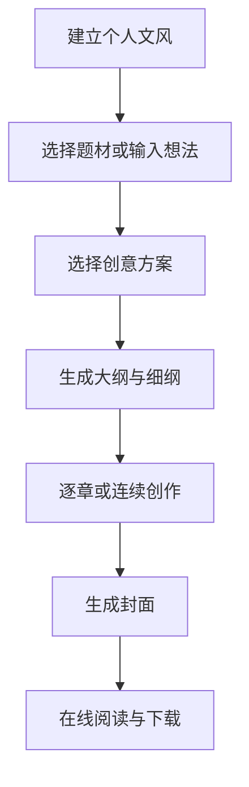

# Eidolon：AI 小说创作与阅读 Agent 最简设计方案

## 1. 产品定位

Eidolon 是一个面向个人使用的 AI 小说创作与阅读网站，覆盖文风沉淀、故事构思、大纲设计、正文创作、封面生成、在线阅读和作品下载的完整流程，并为后续多用户推广预留扩展能力。

第一版以个人创作闭环为目标，不包含评论、关注、付费阅读等社区功能。

## 2. 核心功能

### 2.1 个人文风库

支持：

- 输入一段参考文字。
- 上传 TXT、Markdown 或 DOCX 作品。
- 选择系统内置文风。
- 保存和复用多个长期个人文风档案。

Agent 从参考内容中提取叙述视角、句式特点、语言节奏、对话密度、描写强度、情绪基调、修辞倾向和常用意象，生成可编辑的文风卡片。

名家文风功能提供作家、文学流派及写作特征介绍。实际生成采用抽象文风特征，不直接复制在世作家的独特表达。

### 2.2 题材与创意方案

首页提供悬疑推理、都市情感、科幻未来、东方奇幻、历史架空、青春成长、现实文学和自定义题材卡片。

用户选择题材后直接进入创作工作台，可以：

- 输入自己的故事想法。
- 指定人物、时代、地点、冲突或结局。
- 选择个人文风。
- 选择短篇、中篇或长篇。
- 不输入想法，由 Agent 自由构思。

Agent 根据题材、用户想法和个人文风生成三个原创方案。每个方案包含：

- 暂定书名
- 一句话梗概
- 主角设定
- 核心冲突
- 故事亮点
- 结局方向
- 约 200 字文风示例

用户可以选择、重新生成或组合方案。

### 2.3 大纲与章节细纲

故事大纲包含：

- 作品名称
- 类型与基调
- 世界观
- 主要人物
- 核心冲突
- 故事阶段
- 预计章节数
- 结局方向

章节细纲包含：

- 章节标题
- 出场人物
- 时间与地点
- 本章目标
- 主要事件
- 冲突与转折
- 情绪变化
- 伏笔与回收
- 结尾钩子
- 预计字数

所有内容均可手动编辑、局部重写、增删和调整顺序。

### 2.4 正文创作

支持：

- 逐章生成：默认方式，适合中长篇。
- 连续生成：适合短篇。
- 手动写作与 AI 协作。

编辑能力包括续写、重写、扩写、缩写、润色、调整节奏、增强对话、增强心理或环境描写、按个人文风改写，以及人物、时间线和设定一致性检查。

正文自动保存，并保留必要的历史版本。

### 2.5 长篇小说记忆

每章完成后，Agent 自动维护：

- 章节摘要
- 人物状态与关系
- 世界观设定
- 故事时间线
- 已发生事件
- 已埋及已回收伏笔
- 未解决冲突

生成新章节时，只加载相关设定、摘要和必要原文，以控制上下文长度、响应时间和模型费用。

### 2.6 封面生成

第一版使用通义万相 `wanx2.0-t2i-turbo`。

生成流程：

1. 文字模型根据书名、题材、简介和核心意象生成封面提示词。
2. 通义万相生成不带文字的竖版底图。
3. 网站叠加书名、作者名和副标题。
4. 用户选择、重新生成或调整文字排版。

首期提供极简文学、东方幻想、电影悬疑、青春插画和未来科幻五种封面方向。默认每次生成两张候选图。

### 2.7 在线阅读与下载

阅读器支持：

- 章节目录
- 阅读进度
- 上一章与下一章
- 字号和行距调整
- 全屏阅读
- 阅读皮肤切换
- 返回创作工作台

第一版优先支持 TXT 和 Markdown 下载，后续增加 PDF 和 EPUB。

## 3. 页面设计

第一版设置四个主要页面。

### 3.1 首页

展示：

- 每日一句
- 每日创作灵感
- 题材卡片
- 最近创作
- 最近阅读
- 我的热门作品
- 新建作品入口
- 个人文风库入口

“我的热门作品”按照个人阅读次数和最近使用情况排序，不建立公开作品社区。

### 3.2 创作工作台

新建作品和灵感选择均集成在创作工作台中。

| 区域 | 内容 |
| --- | --- |
| 左侧 | 大纲、分卷、章节、人物、设定、伏笔 |
| 中间 | 创意方案、大纲、细纲或正文编辑器 |
| 右侧 | AI 创作助手 |
| 顶部 | 保存、预览、封面、下载、作品设置 |
| 底部 | 字数、保存状态、当前文风、生成状态 |

首次创作流程：

1. 选择题材。
2. 输入个人想法。
3. 选择个人文风。
4. 选择长短篇。
5. 选择创意方案。
6. 确认故事大纲。
7. 生成章节细纲。
8. 开始正文创作。

### 3.3 个人书架

作品按照构思中、创作中、已完成和已归档分类，展示封面、名称、字数、章节进度和更新时间。

### 3.4 在线阅读页

采用沉浸式单栏阅读设计。每部作品拥有独立阅读地址，第一版默认仅本人可见。

## 4. 文学氛围

### 4.1 每日一句

内容仅使用：

- 公版文学作品摘录
- 用户自己的作品
- 已获得授权的内容
- Agent 生成的原创短句

文学摘录标注作者和作品名称。

### 4.2 每日创作灵感

每天生成一条原创灵感，支持创建新作品、加入当前作品素材库、扩展为故事方案和更换灵感。

### 4.3 页面文案

- 保存成功：文字已落定。
- 内容生成中：故事正在寻找它的下一句话。
- 空白章节：请从一个声音、一扇门或一次告别开始。

文学化元素保持克制，不干扰正文创作和阅读。

## 5. 创作与阅读皮肤

### 5.1 澄心

> 素纸留白，微光落字，让纷乱的故事在一页之间渐渐澄明。

采用米白、墨灰与淡青色，适合文学、古风和长时间写作。

### 5.2 夜航星

> 当城市沉入夜色，文字便成为独自航行时头顶的星光。

采用深蓝黑、暖金和低亮度正文，适合夜间创作、悬疑和科幻。

### 5.3 象牙塔

> 在安静而明亮的高处，替尚未抵达现实的故事留一间房。

采用象牙白、浅灰和暗红点缀，适合现代、青春和日常创作。

## 6. Agent 设计

第一版采用一个总控 Agent，在内部编排以下能力：

- 文风分析
- 创意策划
- 大纲生成
- 章节细纲生成
- 正文生成
- 润色与改写
- 一致性检查
- 小说记忆维护
- 封面提示词生成
- 作品导出

模型分工：

| 任务 | 模型 |
| --- | --- |
| 文风分析、创意、大纲和正文 | DeepSeek |
| 章节摘要与小说记忆 | DeepSeek |
| 复杂一致性检查 | DeepSeek 推理模式 |
| 封面提示词 | DeepSeek |
| 封面底图 | 通义万相 `wanx2.0-t2i-turbo` |
| 书名排版 | 网站程序 |

代码不写死模型供应商，通过统一模型接口保留后续替换能力。

## 7. 最简技术方案

- 前后端：Next.js + TypeScript
- 页面样式：Tailwind CSS
- 正文编辑器：Tiptap
- 本地数据库：SQLite
- 正式部署数据库：PostgreSQL
- 文字模型：DeepSeek API
- 图片模型：通义万相 `wanx2.0-t2i-turbo`
- 文件存储：本地文件，后续可切换 OSS
- 导出格式：TXT、Markdown，后续增加 PDF、EPUB

第一版采用单体架构，不拆分微服务。

代码中预留：

- 模型供应商适配接口
- SQLite 与 PostgreSQL 切换能力
- 本地文件与对象存储切换能力
- 用户 ID
- 作品可见范围
- 阅读量与热度字段

## 8. 核心数据对象

- 用户
- 文风档案
- 小说作品
- 创意方案
- 故事大纲
- 人物档案
- 世界观设定
- 章节细纲
- 章节正文
- 小说记忆
- 伏笔
- 封面
- 阅读进度
- 每日摘录
- 每日灵感

## 9. 第一版开发范围

必须完成：

1. 首页与三套皮肤。
2. 个人文风库。
3. 题材选择和个人想法输入。
4. 三个创意方案。
5. 大纲与章节细纲。
6. 逐章生成和正文编辑。
7. 小说记忆。
8. 万相封面生成。
9. 个人书架。
10. 在线阅读。
11. TXT 和 Markdown 下载。

暂不实现：

- 多用户注册与运营体系
- 公开作品广场
- 评论、关注与付费阅读
- 复杂排行榜
- PDF 与 EPUB 导出
- 高可用和微服务架构

## 10. 部署规划

第一阶段在本地运行，供个人使用。

需要让其他人临时体验时，可采用内网穿透；需要长期稳定访问时，再部署到云服务器或 PaaS，并配置域名、HTTPS、PostgreSQL 和对象存储。

文字和图片均通过第三方 API 生成，因此服务器不需要 GPU。
