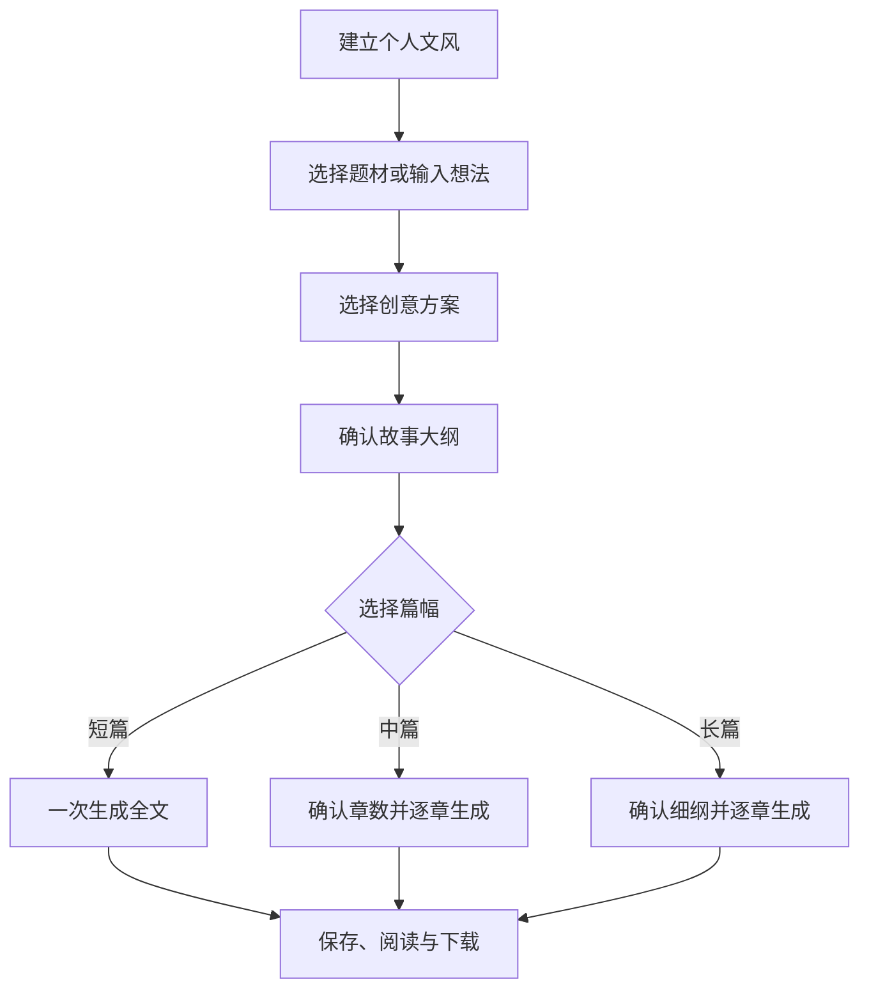

# 纸境（Eidolon）项目上下文

> 用途：在切换 ChatGPT 对话窗口后快速恢复项目背景和当前进度。
>
> 最后更新：2026-08-31（三种篇幅流程、Agent 日志、书架封面及小说记忆）

## 1. 项目概述

- 中文名称：纸境
- 英文名称：Eidolon
- Slogan：白天属于面包，夜晚属于纸境
- GitHub 仓库：`yf990848-droid/Eidolon`
- 主分支：`main`
- 开发分支：`develop`
- 当前阶段：DeepSeek 创作链路、原创写作模式、本地文风库及小说记忆已实现，正式数据持久化尚未接入
- 主要用户：第一版供项目所有者个人使用
- 长期方向：保留多用户、公开作品和互联网部署的扩展能力

纸境是一个集 AI 小说共创、原创写作、作品管理和在线阅读于一体的网站，寓意作品连接现实与梦境。

AI 共创主流程按篇幅分支：

完整设计方案见：[MVP_DESIGN.md](./MVP_DESIGN.md)，问题复盘见：[ENGINEERING_LESSONS.md](./ENGINEERING_LESSONS.md)。

## 2. 已确认的产品决策

### 2.1 使用范围

- 第一版以个人使用为主。
- 暂不实现评论、关注、付费阅读等社区功能。
- 数据结构需要预留用户 ID、作品可见范围、阅读量和热度字段。
- 后续可以增加作品广场、公开阅读和多人访问。

### 2.2 文风能力

- 支持用户输入参考文字。
- 当前支持上传 TXT、Markdown；DOCX 留待后续版本。
- 分析结果沉淀为长期个人文风库。
- 支持保存和复用多个文风档案。
- 首批提供鲁迅、老舍、沈从文、张爱玲、简媜、刘慈欣、海明威、卡夫卡、简·奥斯汀、契诃夫、黑塞的文学特征卡。
- 参考原文仅用于当次分析，不写入浏览器存储；只保存结构化文风卡。
- 生成时采用抽象文风特征，不直接复制在世作家的独特表达。

### 2.3 题材与灵感

- 首页提供题材卡片。
- 选择题材后直接进入创作工作台。
- 用户可以补充自己的故事想法，也可以让 Agent 自由构思。
- Agent 根据题材、用户想法和个人文风生成三个创意方案。
- 每个方案包含梗概、人物、冲突、亮点、结局方向和约 200 字示例段落。
- 新建作品和灵感选择不设置独立页面，统一放入创作工作台。

### 2.4 小说规模

三种篇幅使用不同流程：

- 短篇：确认大纲后一次生成 3000～5000 字完整正文，以单个“全文”章节保存。
- 中篇：确认大纲和章节数后逐章生成，默认 8 章，允许设置 3～20 章。
- 长篇：确认大纲和章节数后生成可编辑章节细纲，再逐章生成；默认 20 章，允许设置 10～50 章。

### 2.5 创作流程

1. 选择题材。
2. 输入个人想法。
3. 选择个人文风。
4. 选择短篇、中篇或长篇。
5. 从三个创意方案中选择或组合。
6. 生成并确认故事大纲。
7. 根据篇幅直接生成整篇、确认章节数，或生成章节细纲。
8. 短篇一次生成全文；中篇和长篇逐章生成正文。
9. 编辑、润色和一致性检查。
10. 生成封面。
11. 在线阅读或下载作品。

### 2.6 小说记忆

中篇和长篇 AI 共创在每章保存后自动维护：

- 章节摘要
- 人物状态和关系
- 世界观设定
- 故事时间线
- 已发生事件
- 已埋伏笔
- 已回收伏笔
- 未解决冲突

保存章节时，Agent 用一次调用同时更新结构化记忆并检查人物、时间线、世界设定和情节冲突。冲突只提示、不阻止保存，也不自动改写正文；记忆更新失败时正文仍会保留。生成下一章时读取结构化记忆、总大纲、当前章细纲和上一章原文，不传入整部小说。短篇和原创写作暂不自动维护小说记忆。

### 2.7 封面

- 当前书架使用程序生成的彩色渐变封面，并已修复封面样式类名不匹配的问题。
- 下一阶段图片模型：通义万相 `wanx2.0-t2i-turbo`。
- 默认每次生成两张候选底图。
- 图片模型只生成不带文字的竖版封面底图。
- 书名、作者名和副标题由网页程序叠加，保证中文排版稳定。
- 首期风格：极简文学、东方幻想、电影悬疑、青春插画、未来科幻。

### 2.8 作品阅读与下载

第一版支持：

- 个人书架
- 独立阅读页面
- 章节目录和阅读进度
- 字号、行距和阅读皮肤
- TXT 和 Markdown 下载

后续增加 PDF 和 EPUB。

## 3. 页面结构

当前包含六个主要页面：

1. 今日页（首页）
2. AI 创作工作台
3. 原创写作页（右侧写作伴侣）
4. 个人文风库
5. 个人书架
6. 在线阅读页

### 3.1 首页

包含：

- 每日一句
- 每日创作灵感
- 题材卡片
- 最近创作
- 最近阅读
- 我的热门作品
- 个人文风库入口

“我的热门作品”按个人阅读次数和最近使用情况排序，第一版不建立公开榜单。

### 3.2 创作工作台

- 左侧：大纲、分卷、章节、人物、设定、伏笔。
- 中间：创意方案、大纲、细纲或正文编辑器。
- 右侧：AI 创作助手。
- 顶部：保存、预览、封面、下载和作品设置。
- 底部：字数、保存状态、当前文风和生成状态。

## 4. 视觉方向

设计目标：美观、简约、艺术、高级，同时保证长时间写作和阅读的舒适度。

三套创作与阅读皮肤：

### 澄心

> 素纸留白，微光落字，让纷乱的故事在一页之间渐渐澄明。

米白、墨灰与淡青色。

### 夜航星

> 当城市沉入夜色，文字便成为独自航行时头顶的星光。

深蓝黑、暖金与低亮度正文。

### 象牙塔

> 在安静而明亮的高处，替尚未抵达现实的故事留一间房。

象牙白、浅灰与暗红点缀。

页面各处需要体现克制的文学氛围：

- 每日一句只使用公版、授权、用户自有或原创内容。
- 每日创作灵感由 Agent 原创生成。
- 保存成功提示：“文字已落定。”
- 生成中提示：“故事正在寻找它的下一句话。”
- 空白章节提示：“请从一个声音、一扇门或一次告别开始。”

## 5. Agent 与模型方案

第一版使用一个总控 Agent，内部编排以下能力：

- 文风分析
- 创意策划
- 大纲生成
- 章节细纲生成
- 正文生成
- 润色与改写
- 一致性检查
- 小说记忆维护
- 封面提示词生成
- 作品导出

模型选择：

| 任务 | 模型 |
| --- | --- |
| 文风、创意、大纲、正文、摘要 | DeepSeek |
| 复杂一致性检查 | DeepSeek 推理模式 |
| 封面提示词 | DeepSeek |
| 封面底图 | 通义万相 `wanx2.0-t2i-turbo` |
| 中文书名排版 | 网站程序 |

约束：

- 使用统一的模型供应商接口，不在业务代码中写死 DeepSeek 或万相。
- API Key 只能放在服务端环境变量中，不能写入代码、浏览器或 Git 仓库。
- 普通任务默认使用非推理模型，复杂结构分析才使用推理模式。
- 每次请求生成 `requestId`，记录任务、模型、耗时、Token 和响应结构，不记录 API Key 或用户原文。
- 仅允许本地显式设置 `AGENT_LOG_RAW_RESPONSE=true` 临时输出原始响应，默认关闭。

## 6. 技术方案

当前已实现：

- 前后端：Next.js + TypeScript
- UI：Tailwind CSS
- 文字生成：DeepSeek API
- 本地数据：浏览器 `localStorage`
- 导出：TXT、Markdown

下一阶段目标：

- 正文编辑器：Tiptap
- 本地数据库：SQLite，正式部署切换 PostgreSQL
- 图片生成：通义万相 API
- 本地文件存储，正式部署切换 OSS 或其他对象存储

架构原则：

- 第一版采用单体应用，不拆分微服务。
- 预留 SQLite/PostgreSQL 存储适配。
- 预留本地文件/对象存储适配。
- 服务端负责所有模型调用。
- 个人本地运行不需要 GPU。
- 他人临时访问可以使用内网穿透。
- 长期公开访问时再部署到云服务器或 PaaS。

## 7. 当前范围

已完成：

1. 首页与三套皮肤。
2. 个人文风库。
3. 题材选择和个人想法输入。
4. 三个创意方案。
5. 大纲与章节细纲。
6. 短篇整篇生成、中篇逐章生成、长篇细纲后逐章生成。
7. 原创写作页与按需响应的写作伴侣。
8. 个人书架、在线阅读及已完成作品同步。
9. 程序生成的彩色封面。
10. TXT 和 Markdown 下载。
11. DeepSeek 请求结构化日志。
12. 中篇和长篇的结构化小说记忆及非阻断一致性提醒。

下一阶段：

- SQLite/PostgreSQL 数据持久化
- 通义万相封面生成
- Tiptap 编辑器和必要的历史版本

暂不实现：

- 多用户注册与运营体系
- 公开作品广场
- 评论、关注和付费阅读
- 复杂热度排行榜
- PDF 与 EPUB 导出
- 微服务和高可用架构

## 8. 仓库状态

截至 2026-08-31：

- `main` 已合并早期可运行版本。
- `develop` 是当前开发分支，包含主分支之后新增的文风、日志、篇幅分流和封面修复。
- 已初始化 Next.js、TypeScript、Tailwind CSS 项目。
- 已完成今日页、AI 创作、原创写作、个人文风库、个人书架和在线阅读页面。
- 已实现澄心、夜航星、象牙塔三套可切换主题。
- 已实现题材输入、模拟创意方案、模拟大纲、草稿本地保存和阅读进度。
- 已接入 DeepSeek 服务端 Provider，支持创意、大纲、章节正文与润色改写。
- 已新增独立原创写作页；正文由用户自行创作，右侧伴侣仅在主动询问时给出建议。
- AI 共创与写作伴侣共用模型 Provider，但业务路径彼此隔离。
- 已新增个人文风库页面，支持粘贴文字或上传 TXT、Markdown，并由 DeepSeek 生成可编辑的结构化文风卡。
- 已加入中外文学特征静态预设；在世作者只使用抽象特征，不要求模型直接模仿本人。
- AI 共创可选择系统文风、个人文风或文学特征，并将文风指令快照保存到作品。
- 已按篇幅拆分 AI 共创流程：短篇整篇生成、中篇按章数逐章生成、长篇确认章节细纲后逐章生成。
- 章节数和长篇细纲随作品保存，旧作品因字段可选可继续读取。
- Agent 已加入结构化日志；一次真实文风分析返回全部字段，未复现“不完整”问题，因此暂未放宽 Schema。
- 已修复书架封面样式类名与 CSS 定义不一致造成的无颜色问题，不迁移既有作品数据。
- 中篇和长篇在保存章节时更新章节摘要与结构化小说记忆，同时返回非阻断一致性提醒；更新失败不丢失正文。
- 下一章生成会读取小说记忆、总大纲、当前章细纲和上一章正文；短篇与原创写作不自动调用该能力。
- 未配置 `DEEPSEEK_API_KEY` 时自动使用 Mock Provider。
- AI 共创稿与原创稿当前均保存到浏览器 `localStorage`。
- 已有设计与复盘文档：`docs/MVP_DESIGN.md`、`docs/ENGINEERING_LESSONS.md`。

关键提交：

- `32d00c2`：`docs: add MVP design proposal`
- `08e0687`：个人文风识别与中外文学特征预设
- `4a62b36`：Agent 结构化诊断日志与工程记录
- `4af05ef`：按短篇、中篇、长篇拆分创作流程
- `cca54e6`：恢复书架封面颜色

## 9. 下一步建议

下一阶段建议：

1. 用真实 DeepSeek 验证多章记忆累积、冲突提示以及 10～50 章长篇细纲的稳定性。
2. 将作品、章节、文风档案和小说记忆从 `localStorage` 迁移到 SQLite，并保留 PostgreSQL 适配方向。
3. 接入通义万相 `wanx2.0-t2i-turbo` 封面生成。
4. 实现 Tiptap 编辑器与必要的历史版本；PDF、EPUB 留待后续。

用户本地已配置 `DEEPSEEK_API_KEY`；接入万相前再配置 `DASHSCOPE_API_KEY`。所有密钥均只保存在 `.env.local`，不得提交到 GitHub。

## 10. 给新对话窗口的指令

可以将下面这段话发送给新的 AI：

> 请通过 GitHub 读取 `yf990848-droid/Eidolon` 仓库 `develop` 分支的 `docs/PROJECT_CONTEXT.md` 和 `docs/MVP_DESIGN.md`，恢复 Eidolon 项目上下文。后续开发均基于 `develop` 分支，先检查仓库实际状态，再给出最小修改方案；未经我明确要求，不要合并到 `main`。每完成一个重要阶段，请同步更新 `docs/PROJECT_CONTEXT.md`。
