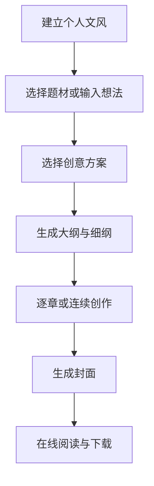

# Eidolon 项目上下文

> 用途：在切换 ChatGPT 对话窗口后快速恢复项目背景和当前进度。
>
> 最后更新：2026-08-25（第一阶段前端原型）

## 1. 项目概述

- 项目名称：Eidolon
- GitHub 仓库：`yf990848-droid/Eidolon`
- 主分支：`main`
- 开发分支：`develop`
- 当前阶段：第一阶段前端交互原型已完成，真实模型与正式数据持久化尚未接入
- 主要用户：第一版供项目所有者个人使用
- 长期方向：保留多用户、公开作品和互联网部署的扩展能力

Eidolon 是一个集 AI 小说创作、作品管理和在线阅读于一体的网站。

核心流程：

完整设计方案见：[MVP_DESIGN.md](./MVP_DESIGN.md)。

## 2. 已确认的产品决策

### 2.1 使用范围

- 第一版以个人使用为主。
- 暂不实现评论、关注、付费阅读等社区功能。
- 数据结构需要预留用户 ID、作品可见范围、阅读量和热度字段。
- 后续可以增加作品广场、公开阅读和多人访问。

### 2.2 文风能力

- 支持用户输入参考文字。
- 支持上传 TXT、Markdown 和 DOCX 作品。
- 分析结果沉淀为长期个人文风库。
- 支持保存和复用多个文风档案。
- 提供名家及文学流派介绍。
- 生成时采用抽象文风特征，不直接复制在世作家的独特表达。

### 2.3 题材与灵感

- 首页提供题材卡片。
- 选择题材后直接进入创作工作台。
- 用户可以补充自己的故事想法，也可以让 Agent 自由构思。
- Agent 根据题材、用户想法和个人文风生成三个创意方案。
- 每个方案包含梗概、人物、冲突、亮点、结局方向和约 200 字示例段落。
- 新建作品和灵感选择不设置独立页面，统一放入创作工作台。

### 2.4 小说规模

同时支持：

- 短篇：允许连续生成或逐章生成。
- 中篇：推荐逐章生成。
- 长篇：采用分卷、逐章生成和结构化小说记忆。

### 2.5 创作流程

1. 选择题材。
2. 输入个人想法。
3. 选择个人文风。
4. 选择短篇、中篇或长篇。
5. 从三个创意方案中选择或组合。
6. 生成并确认故事大纲。
7. 生成章节细纲。
8. 逐章或连续生成正文。
9. 编辑、润色和一致性检查。
10. 生成封面。
11. 在线阅读或下载作品。

### 2.6 小说记忆

每章完成后自动维护：

- 章节摘要
- 人物状态和关系
- 世界观设定
- 故事时间线
- 已发生事件
- 已埋伏笔
- 已回收伏笔
- 未解决冲突

生成下一章时，读取相关结构化记忆、章节摘要和必要原文，避免每次传入整部小说。

### 2.7 封面

- 第一版图片模型：通义万相 `wanx2.0-t2i-turbo`。
- 默认每次生成两张候选底图。
- 图片模型只生成不带文字的竖版封面底图。
- 书名、作者名和副标题由网页程序叠加，保证中文排版稳定。
- 首期风格：极简文学、东方幻想、电影悬疑、青春插画、未来科幻。

### 2.8 作品阅读与下载

第一版支持：

- 个人书架
- 独立阅读页面
- 章节目录和阅读进度
- 字号、行距和阅读皮肤
- TXT 和 Markdown 下载

后续增加 PDF 和 EPUB。

## 3. 页面结构

第一版只设置四个主要页面：

1. 首页
2. 创作工作台
3. 个人书架
4. 在线阅读页

### 3.1 首页

包含：

- 每日一句
- 每日创作灵感
- 题材卡片
- 最近创作
- 最近阅读
- 我的热门作品
- 个人文风库入口

“我的热门作品”按个人阅读次数和最近使用情况排序，第一版不建立公开榜单。

### 3.2 创作工作台

- 左侧：大纲、分卷、章节、人物、设定、伏笔。
- 中间：创意方案、大纲、细纲或正文编辑器。
- 右侧：AI 创作助手。
- 顶部：保存、预览、封面、下载和作品设置。
- 底部：字数、保存状态、当前文风和生成状态。

## 4. 视觉方向

设计目标：美观、简约、艺术、高级，同时保证长时间写作和阅读的舒适度。

三套创作与阅读皮肤：

### 澄心

> 素纸留白，微光落字，让纷乱的故事在一页之间渐渐澄明。

米白、墨灰与淡青色。

### 夜航星

> 当城市沉入夜色，文字便成为独自航行时头顶的星光。

深蓝黑、暖金与低亮度正文。

### 象牙塔

> 在安静而明亮的高处，替尚未抵达现实的故事留一间房。

象牙白、浅灰与暗红点缀。

页面各处需要体现克制的文学氛围：

- 每日一句只使用公版、授权、用户自有或原创内容。
- 每日创作灵感由 Agent 原创生成。
- 保存成功提示：“文字已落定。”
- 生成中提示：“故事正在寻找它的下一句话。”
- 空白章节提示：“请从一个声音、一扇门或一次告别开始。”

## 5. Agent 与模型方案

第一版使用一个总控 Agent，内部编排以下能力：

- 文风分析
- 创意策划
- 大纲生成
- 章节细纲生成
- 正文生成
- 润色与改写
- 一致性检查
- 小说记忆维护
- 封面提示词生成
- 作品导出

模型选择：

| 任务 | 模型 |
| --- | --- |
| 文风、创意、大纲、正文、摘要 | DeepSeek |
| 复杂一致性检查 | DeepSeek 推理模式 |
| 封面提示词 | DeepSeek |
| 封面底图 | 通义万相 `wanx2.0-t2i-turbo` |
| 中文书名排版 | 网站程序 |

约束：

- 使用统一的模型供应商接口，不在业务代码中写死 DeepSeek 或万相。
- API Key 只能放在服务端环境变量中，不能写入代码、浏览器或 Git 仓库。
- 普通任务默认使用非推理模型，复杂结构分析才使用推理模式。

## 6. 技术方案

已确认的最简技术栈：

- 前后端：Next.js + TypeScript
- UI：Tailwind CSS
- 正文编辑器：Tiptap
- 本地数据库：SQLite
- 正式部署数据库：PostgreSQL
- 本地文件：作品附件、封面和导出文件
- 正式文件存储：OSS 或其他对象存储
- 文字生成：DeepSeek API
- 图片生成：通义万相 API
- 第一版导出：TXT、Markdown

架构原则：

- 第一版采用单体应用，不拆分微服务。
- 预留 SQLite/PostgreSQL 存储适配。
- 预留本地文件/对象存储适配。
- 服务端负责所有模型调用。
- 个人本地运行不需要 GPU。
- 他人临时访问可以使用内网穿透。
- 长期公开访问时再部署到云服务器或 PaaS。

## 7. 第一版范围

必须完成：

1. 首页与三套皮肤。
2. 个人文风库。
3. 题材选择和个人想法输入。
4. 三个创意方案。
5. 大纲与章节细纲。
6. 逐章生成和正文编辑。
7. 小说记忆。
8. 万相封面生成。
9. 个人书架。
10. 在线阅读。
11. TXT 和 Markdown 下载。

暂不实现：

- 多用户注册与运营体系
- 公开作品广场
- 评论、关注和付费阅读
- 复杂热度排行榜
- PDF 与 EPUB 导出
- 微服务和高可用架构

## 8. 仓库状态

截至 2026-08-25：

- `main` 已提交产品最简设计方案。
- `develop` 已从 `main` 创建，作为后续开发分支。
- 已初始化 Next.js、TypeScript、Tailwind CSS 项目。
- 已完成首页、创作工作台、个人书架和在线阅读四个页面。
- 已实现澄心、夜航星、象牙塔三套可切换主题。
- 已实现题材输入、模拟创意方案、模拟大纲、草稿本地保存和阅读进度。
- 已预留 DeepSeek 与通义万相 Provider 类型接口及环境变量模板。
- 当前所有生成内容均为模拟数据，不会产生模型费用。
- 已有设计文件：`docs/MVP_DESIGN.md`。
- 本文件仅存在于 `develop` 分支。

关键提交：

- `32d00c2`：`docs: add MVP design proposal`

## 9. 下一步建议

下一阶段建议：

1. 由用户验收第一阶段页面与交互方向。
2. 接入 DeepSeek 服务端 API，实现文风分析、创意和大纲生成。
3. 确定正式数据层，并实现作品、章节和文风档案持久化。
4. 接入通义万相 `wanx2.0-t2i-turbo` 封面生成。
5. 实现正文编辑、小说记忆和 TXT/Markdown 导出。

接入真实模型前，用户需在本地配置 `DEEPSEEK_API_KEY` 和 `DASHSCOPE_API_KEY`，密钥不得提交到 GitHub。

## 10. 给新对话窗口的指令

可以将下面这段话发送给新的 AI：

> 请通过 GitHub 读取 `yf990848-droid/Eidolon` 仓库 `develop` 分支的 `docs/PROJECT_CONTEXT.md` 和 `docs/MVP_DESIGN.md`，恢复 Eidolon 项目上下文。后续开发均基于 `develop` 分支，先检查仓库实际状态，再给出最小修改方案；未经我明确要求，不要合并到 `main`。每完成一个重要阶段，请同步更新 `docs/PROJECT_CONTEXT.md`。
